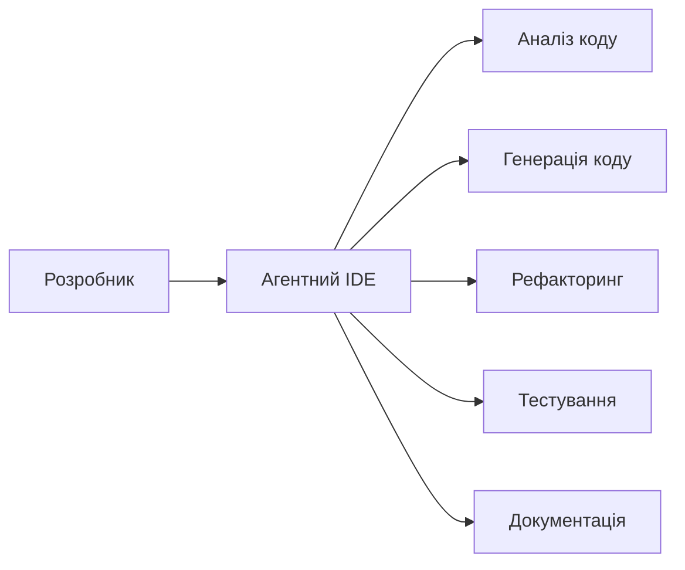

# Правила, команди та навички для Agentic IDE

---
layout: intro
---

# Правила, команди та навички для Агентних IDE

Презентація про ефективну роботу з агентними інтегрованими середовищами розробки

---

# Що таке Агентні IDE?

<div class="grid grid-cols-2 gap-4">
<div>

<v-clicks>

- **Агентні IDE** - це наступний крок в еволюції інструментів розробки
- Використовують штучний інтелект для допомоги в програмуванні
- Може самостійно виконувати завдання та пропонувати рішення
- Інтегрують великі мовні моделі безпосередньо в процес розробки

</v-clicks>

</div>

<div>

<v-clicks>



</v-clicks>

</div>
</div>

---

# Основні правила роботи

<div class="grid grid-cols-2 gap-6">
<div>

<v-clicks>

## 🔒 Правило №1: Ясність інструкцій
- **Чітко формулюйте завдання**
- Використовуйте конкретні терміни
- Уникайте неоднозначностей

</v-clicks>

</div>

<div>

<v-clicks>

## 🎯 Правило №2: Контекст важливий
- **Надавайте достатньо контексту**
- Показуйте пов'язаний код
- Вказуйте обмеження та вимоги

</v-clicks>

</div>
</div>

---

# Правила роботи (продовження)

<div class="grid grid-cols-2 gap-6">
<div>

<v-clicks>

## ⚡ Правило №3: Ітеративний підхід
- **Розбивайте складні завдання**
- Перевіряйте проміжні результати
- Коригуйте напрямок за потреби

</v-clicks>

</div>

<div>

<v-clicks>

## 🔍 Правило №4: Перевірка результатів
- **Завжди перевіряйте згенерований код**
- Тестуйте функціональність
- Переконуйтеся в правильності

</v-clicks>

</div>
</div>

---

# Основні команди та інструменти

<div class="grid grid-cols-3 gap-4">
<div>

<v-clicks>

## Пошук та навігація
- `grep` - пошук тексту
- `codebase_search` - семантичний пошук
- `read_file` - читання файлів
- `list_dir` - перегляд директорій

</v-clicks>

</div>

<div>

<v-clicks>

## Редагування коду
- `search_replace` - заміна тексту
- `write` - створення файлів
- `run_terminal_cmd` - виконання команд
- `todo_write` - управління завданнями

</v-clicks>

</div>

<div>

<v-clicks>

## Аналіз та діагностика
- `read_lints` - перевірка помилок
- `run_terminal_cmd` - тестування
- `codebase_search` - розуміння коду

</v-clicks>

</div>
</div>

---

# Навички для ефективної роботи

<div class="grid grid-cols-2 gap-6">
<div>

<v-clicks>

## Технічні навички

- **Програмування** - розуміння мов та фреймворків
- **Системне мислення** - бачення цілісної картини
- **Дебагінг** - пошук та виправлення помилок
- **Тестування** - забезпечення якості коду

</v-clicks>

</div>

<div>

<v-clicks>

## Комунікативні навички

- **Чітка комунікація** - точні інструкції
- **Критичне мислення** - оцінка результатів
- **Адаптивність** - гнучкість у підходах
- **Навчання** - постійне вдосконалення

</v-clicks>

</div>
</div>

---

# Найкращі практики

<div class="grid grid-cols-2 gap-4">
<div>

<v-clicks>

## 📝 Планування
- **Розбивайте завдання** на маленькі кроки
- Використовуйте TODO списки для організації
- Перевіряйте прогрес регулярно

</v-clicks>

</div>

<div>

<v-clicks>

## 🔄 Ітерації
- **Тестуйте** кожну зміну
- **Рефакторьте** код поступово
- **Документуйте** важливі рішення

</v-clicks>

</div>
</div>

---

# Найкращі практики (продовження)

<div class="grid grid-cols-2 gap-4">
<div>

<v-clicks>

## 🛡️ Безпека
- **Перевіряйте** всі зміни перед комітом
- **Тестуйте** функціональність
- **Робіть бекапи** важливих файлів

</v-clicks>

</div>

<div>

<v-clicks>

## 📚 Навчання
- **Вивчайте** нові інструменти
- **Експериментуйте** з різними підходами
- **Діліться** знаннями з командою

</v-clicks>

</div>
</div>

---

# Приклади ефективних команд

<div class="grid grid-cols-2 gap-4">
<div>

<v-clicks>

## Поганий приклад
```
Напиши код для веб-сайту
```

**Проблеми:**
- Неясно що саме потрібно
- Відсутній контекст
- Немає технічних деталей

</v-clicks>

</div>

<div>

<v-clicks>

## Хороший приклад
```
Створи React компонент для відображення списку користувачів.
Використовуй TypeScript, додай пропси для даних користувачів,
реалізуй сортування за ім'ям та пагінацію.
Компонент повинен бути доступним (accessibility).
```

**Переваги:**
- Конкретні вимоги
- Технічні деталі
- Функціональні особливості

</v-clicks>

</div>
</div>

---

# Типові помилки та як їх уникнути

<div class="grid grid-cols-2 gap-6">
<div>

<v-clicks>

## 🚫 Поширені помилки

- **Занадто загальні інструкції**
- **Відсутність тестування**
- **Ігнорування помилок лінтера**
- **Великі коміти без перевірки**

</v-clicks>

</div>

<div>

<v-clicks>

## ✅ Як уникнути

- **Деталізуйте завдання**
- **Тестуйте регулярно**
- **Виправляйте помилки одразу**
- **Робіть невеликі, перевірені зміни**

</v-clicks>

</div>
</div>

---

# Інструменти для перевірки якості

<div class="grid grid-cols-3 gap-4">
<div>

<v-clicks>

## Статичний аналіз
- **ESLint** - перевірка стилю коду
- **TypeScript** - типізація
- **Prettier** - форматування

</v-clicks>

</div>

<div>

<v-clicks>

## Тестування
- **Unit тести** - Jest, Vitest
- **Integration тести** - Cypress
- **E2E тести** - Playwright

</v-clicks>

</div>

<div>

<v-clicks>

## Інструменти IDE
- **read_lints** - діагностика
- **run_terminal_cmd** - автоматизація
- **codebase_search** - аналіз коду

</v-clicks>

</div>
</div>

---

# Висновки

<div class="text-center">

<v-clicks>

## 🎯 Ключові моменти

- **Ясність** у спілкуванні з AI
- **Систематичний підхід** до розробки
- **Постійне тестування** та перевірка
- **Навчання** та адаптація до нових інструментів

</v-clicks>

<div class="mt-8">

<v-clicks>

## 🚀 Майбутнє Агентних IDE

- Інтеграція більш складних моделей штучного інтелекту
- Автоматизація рутинних завдань
- Покращення якості коду
- Швидший цикл розробки

</v-clicks>

</div>

</div>

---
layout: end
---

# Дякую за увагу!

**Запитання?**---

# Генерація зображень з OpenAI API

<v-clicks>

- **DALL-E** - інструмент для створення зображень з тексту
- **API інтеграція** - автоматизація генерації
- **Креативність** - візуалізація ідей та концепцій
- **Продуктивність** - швидке створення візуалів

</v-clicks>

---

# API для генерації зображень

## OpenAI DALL-E API

<v-clicks>

- **Модель**: DALL-E 3 (найновіша)
- **Формати**: PNG, WebP
- **Розміри**: 1024x1024, 1024x1792, 1792x1024
- **Ліміт**: 50 зображень/хвилина
- **Ціна**: $0.080 за зображення (1024×1024)

</v-clicks>

---

# Приклад генерації зображення

## Python код для OpenAI API

```python
import openai
import requests
from PIL import Image
import io

# Налаштування API
openai.api_key = "your-api-key-here"

# Генерація зображення
response = openai.Image.create(
    model="dall-e-3",
    prompt="Агентний IDE з штучним інтелектом допомагає розробнику писати код, українська мова, технологічний стиль",
    size="1024x1024",
    quality="standard",
    n=1,
)

# Отримання URL зображення
image_url = response.data[0].url

# Завантаження та збереження
image_response = requests.get(image_url)
image = Image.open(io.BytesIO(image_response.content))
image.save("generated-image.png")
```

---

# Промпти для технічних зображень

<v-clicks>

## Для IDE інтерфейсу:
```
"Modern code editor with AI assistant helping developer write code, dark theme, glowing effects, futuristic UI elements"

## Для діаграм процесів:
```
"Flowchart diagram showing AI development workflow, clean minimal design, arrows and boxes, blue and green color scheme"

## Для архітектури системи:
```
"System architecture diagram with AI components, neural networks, data flow arrows, cloud infrastructure icons"
```

## Для концептуальних ілюстрацій:
```
"Abstract representation of artificial intelligence assisting software development, circuit patterns, digital brain, code snippets floating"
```

</v-clicks>

---

# Інтеграція в презентацію

## Slidev синтаксис для зображень

<v-clicks>

### Локальні зображення:
```markdown

```

### Зовнішні URL:
```markdown

```

### З розмірами:
```markdown

```

### З центровкою:
```markdown
<div class="text-center">
  
</div>
```

</v-clicks>

---

# Практичні приклади

## 1. Генерація іконок та ілюстрацій

<v-clicks>

**Промпт:**
```
"Flat design icon of AI assistant robot helping programmer code, minimal style, blue and purple colors"
```

**Результат:**
*Тут буде згенерована іконка*

</v-clicks>

---

## 2. Діаграми процесів

<v-clicks>

**Промпт:**
```
"Clean flowchart showing AI-powered development cycle: Plan → Code → Test → Deploy, with AI assistant icons"
```

**Результат:**
*Тут буде діаграма процесу*

</v-clicks>

---

## 3. Концептуальні ілюстрації

<v-clicks>

**Промпт:**
```
"Digital brain connected to code editor, neural network patterns, futuristic interface, glowing blue circuits"
```

**Результат:**
*Тут буде концептуальна ілюстрація*

</v-clicks>

---

# Автоматизація генерації

## Node.js скрипт для пакетної обробки

```javascript
const OpenAI = require('openai');
const fs = require('fs').promises;
const path = require('path');

const openai = new OpenAI({
  apiKey: process.env.OPENAI_API_KEY,
});

async function generateSlideImage(slideTopic, outputPath) {
  const prompt = `Create a professional technical illustration for a presentation slide about: ${slideTopic}.
  Style: Modern, clean, technology-focused, suitable for developer audience, high contrast, professional colors.`;

  try {
    const response = await openai.images.generate({
      model: "dall-e-3",
      prompt: prompt,
      size: "1024x1024",
      quality: "standard",
    });

    // Завантаження та збереження зображення
    const imageUrl = response.data[0].url;
    const imageResponse = await fetch(imageUrl);
    const buffer = await imageResponse.arrayBuffer();

    await fs.writeFile(outputPath, Buffer.from(buffer));
    console.log(`✅ Image saved: ${outputPath}`);

  } catch (error) {
    console.error(`❌ Error generating image: ${error.message}`);
  }
}

// Використання
generateSlideImage(
  "Agentic IDE workflow",
  "images/agentic-ide-workflow.png"
);
```

---

# Структура папки images/

```
images/
├── slides/
│   ├── slide-01-ai-concept.png
│   ├── slide-02-development-workflow.png
│   └── slide-03-architecture.png
├── icons/
│   ├── ai-assistant.png
│   ├── code-editor.png
│   └── neural-network.png
└── diagrams/
    ├── ai-process-flow.png
    ├── system-architecture.png
    └── data-flow.png
```

---

# Кращі практики

<v-clicks>

## Для промптів:
- **Конкретність** - детально описуйте, що потрібно
- **Стиль** - вказуйте "технічний", "професійний", "мінімалістичний"
- **Колір** - "блакитний та зелений", "темна тема"
- **Формат** - "діаграма", "іконка", "ілюстрація"

## Для презентацій:
- **Оптимізація** - стискайте зображення для вебу
- **Alt текст** - додавайте опис для доступності
- **Розміри** - адаптуйте під слайди (600-800px)
- **Качество** - використовуйте HD для важливих зображень

## Для продуктивності:
- **Кешування** - зберігайте згенеровані зображення
- **Пакетна обробка** - генеруйте кілька зображень одночасно
- **Шаблони** - створюйте базові промпти для повторного використання

</v-clicks>

---

# Інструменти та альтернативи

<v-clicks>

## OpenAI DALL-E
- **Переваги**: Висока якість, розуміння контексту
- **Недоліки**: Вартість, ліміт запитів
- **Ціна**: $0.080 - $0.120 за зображення

## Stable Diffusion (локально)
- **Переваги**: Безкоштовно, необмежено
- **Недоліки**: Потрібно налаштування, менша якість
- **Інструменти**: Automatic1111, ComfyUI

## Midjourney (Discord)
- **Переваги**: Висока художня якість
- **Недоліки**: Через Discord, платно
- **Ціна**: $10/місяць

## Додаткові інструменти:
- **Canva Magic Design** - для простих ілюстрацій
- **Draw.io** - для діаграм (безкоштовно)
- **Figma** - для прототипів інтерфейсів

</v-clicks>

---
